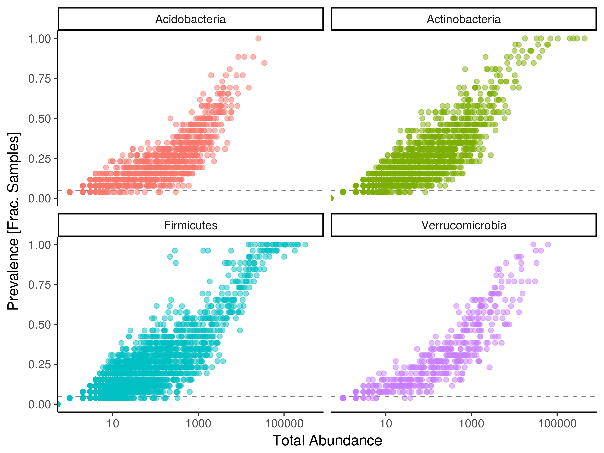
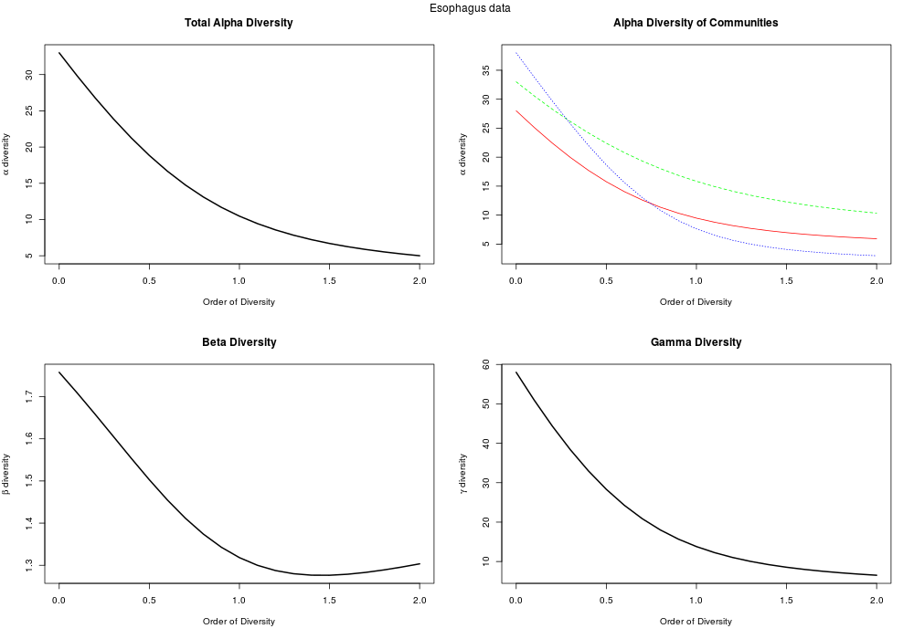
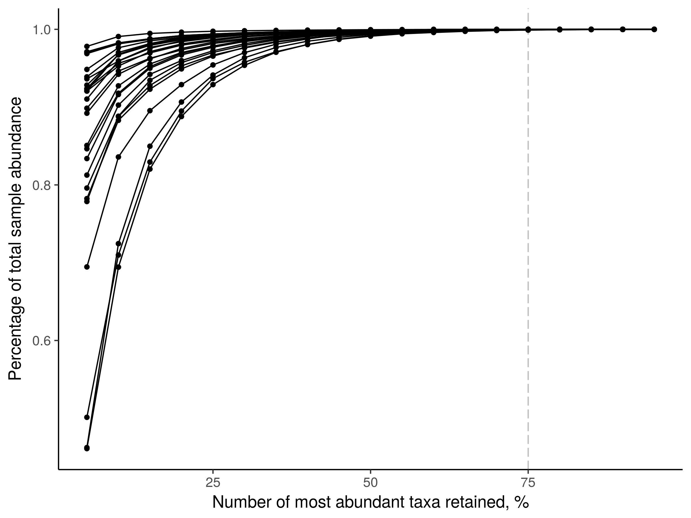

# metagMisc
[](https://doi.org/10.5281/zenodo.571403)
[](https://cran.r-project.org/package=metagMisc)
[](https://github.com/vmikk/metagMisc/releases/latest)

Miscellaneous functions for metagenomic analysis.

The repository is currently in **ALPHA** state. Nothing is guaranteed and the material is subject to change without a notice (e.g., function names or arguments).

# Getting started

Vignette is under construction.

# Package features
- Multiple rarefaction
- OTU abundance averaging following CoDa (Compositional Data Analysis) workflow
- Phylogenetic diversity estimation
- Pairwise dissimilarity boxplots

- Prevalence plots (total OTU abundance vs OTU prevalence)

- Diversity profiles based on Hill numbers (with `entropart` package)

- Extraction of the most abundant OTUs



# Installation
```
devtools::install_github("vmikk/metagMisc")
```

## Dependencies

`source("http://bioconductor.org/biocLite.R")`
* phyloseq: `biocLite("phyloseq")`
* dada2: `biocLite("dada2")`
* ALDEx2: `biocLite("ALDEx2")`
* metagenomeSeq: `biocLite("metagenomeSeq")`
* DESeq2: `biocLite("DESeq2")`
* vegan: `install.packages("vegan")`
* ggplot2
* plyr
* openssl

# Acknowledgements
The development of this software was supported by RFBR grant 16-04-01259.
