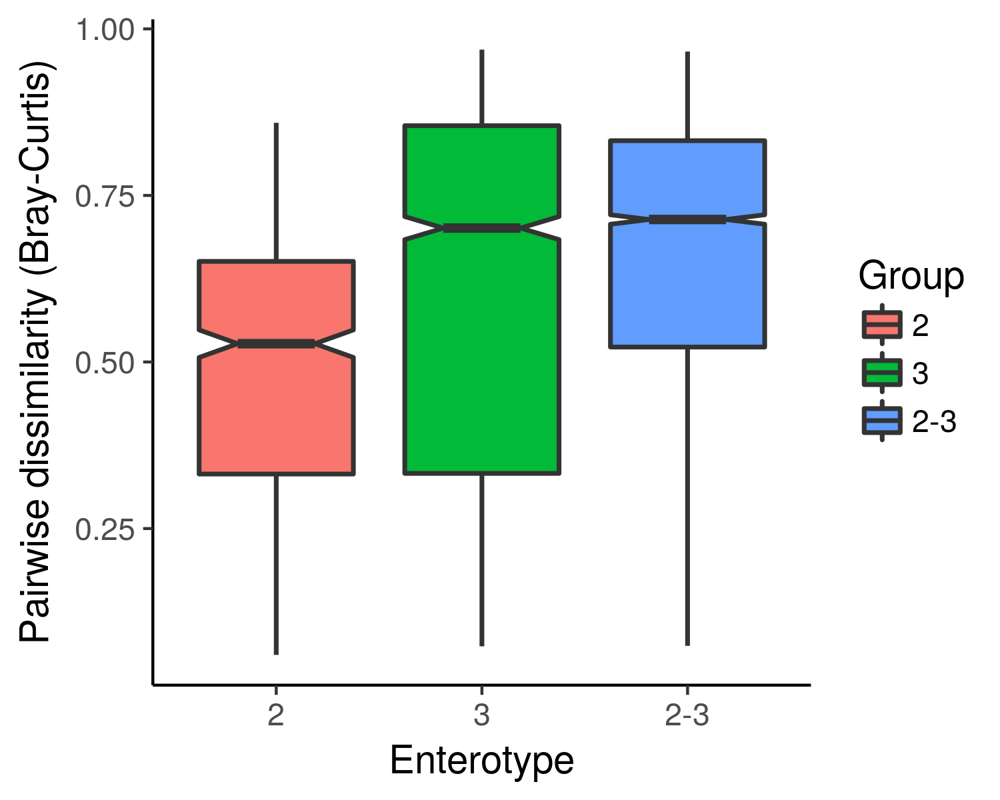

# metagMisc 

<!-- badges: start -->

[](https://doi.org/10.5281/zenodo.597622)
[](https://cran.r-project.org/package=metagMisc)
[](https://github.com/vmikk/metagMisc/releases/latest)

<!-- badges: end -->

Miscellaneous functions for metagenomic analysis.  

metagMisc package contains miscellaneous functions for metabarcoding and metagenomic analysis, including data transformations, several parsers (for USERCH UC-format; BLAST, SINA and STAMPA outputs, etc.), taxonomy handlers (SILVA, QIIME, AMPTk), phyloseq-shortcuts (multiple rarefaction, phyloseq splitting and exporting), and DADA2-shortcuts (error rate estimation on the subset of data, export of denoised amplicons in fasta).  

The repository is currently in **ALPHA** state. Nothing is guaranteed and the material is subject to change without a notice (e.g., function names or arguments).  

# Getting started

Vignette is under construction.

# Package features
* Multiple rarefaction
* OTU abundance averaging following CoDa (Compositional Data Analysis) workflow
* Phylogenetic diversity estimation (including standardized effect sizes)
* Pairwise dissimilarity boxplots

* Prevalence plots (total OTU abundance vs OTU prevalence)

* Diversity profiles based on Hill numbers (with `entropart` package)

* Various data filtering options (e.g., extraction of the most abundant OTUs)

* Taxonomic resolution visualization


# Installation
```
devtools::install_github("vmikk/metagMisc")
```

## Dependencies

`source("http://bioconductor.org/biocLite.R")`
* phyloseq: `biocLite("phyloseq")`
* dada2: `biocLite("dada2")`
* ALDEx2: `biocLite("ALDEx2")`
* metagenomeSeq: `biocLite("metagenomeSeq")`
* DESeq2: `biocLite("DESeq2")`
* vegan: `install.packages("vegan")`
* ggplot2
* plyr
* openssl

# Acknowledgements
`metagMisc` stands on the shoulders of numerous R-packages (see Dependencies). In particular, it would not have happened without [phyloseq](https://github.com/joey711/phyloseq/) and [vegan](https://github.com/vegandevs/vegan/) packages. Please cite R and R packages when you use them for data analysis. 

The development of this software was supported by RFBR grants 16-04-01259 and 15-29-02765.
